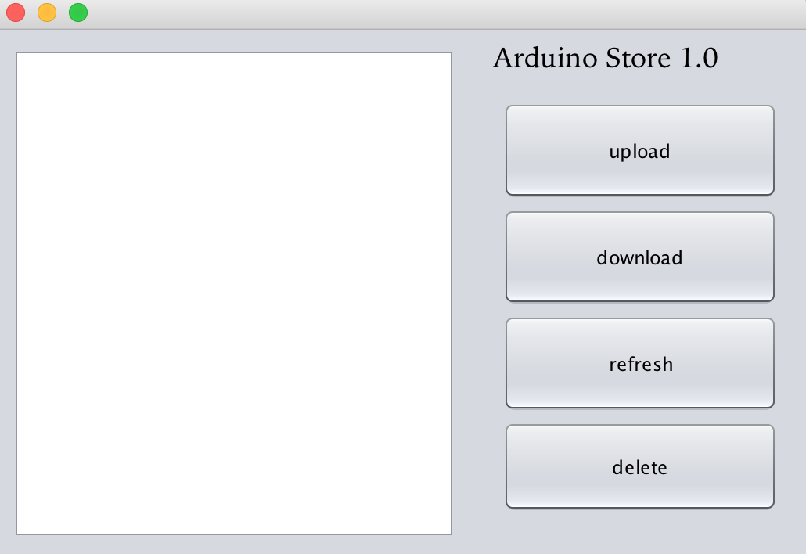

# Project - Cloud Storage
**Group 42 - _Hongru Xiang_, _Jerry Huang_, _Taegoen Lee_**
## Tools Used
- Arduino Uno R3
- Ethernet Shield
- Micro SD card - 2Gb

**Software Component**
- Arduino - C/C++: Arduino IDE
- Desktop app - Java: NetBeans

## To Start With
* File **_ArduinoStore_** is the Java desktop app. 
	* The source code is built with NetBeans IDE. If one could not run it, a NetBeans IDE might be needed to run the project.
* File **_StorageServer_** is the Arduino source code.
## Some Notes
Arduino ueses Ethernet shield and it needs to be connected with Ethernet. It could not operate SD card and Ethernet port simultaneously. To improve it, one can get two arduinos with Ethernet Shield, and use I2C to communicate with each other. Although I failed to make them communicate with each other effectively.
  **I'll try to make I2C communication possible sooner or later when I got time**
  Or to use a wifi module like ESP8266. Our ESP8266 is broken and cannot communicate with Arduino. I haven't tried using USB serial(FTDI), but theoratically if it cannot communicate with Arduino, it cannot work using USB serial either.
 
  With the Arduino source code, the Arduino can be a fully functioning server with some slight changes. It can read and response with HTTP request pretty well.

### Some thoughts about further development
Hopefully create a more powerful and flexible library for every one who wants to use Arduino to build a online hardrive.
  Probably connect Arduino with an actual drive instead of SD card. (Always wanted to do, but did not have enough time. I'll do it though).
### Picture from java desktop

### Picture from Arduino side

